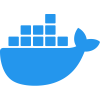

<!DOCTYPE html>
<html lang="en">
<head>
  <meta charset="UTF-8">
  <meta name="viewport" content="width=device-width, initial-scale=1.0">
  <meta name="keywords" content="Sergey Rudenko, Sergey Rudenko GitHub, ArchDeadShadow, ArchDeadShadow GitHub, Fullstack Developer, Front-End Developer, Back-End Developer, JavaScript Developer, React Developer, JavaScript, TypeScript, React, React Hooks, Context API, React Router, Node.js, Express.js, MongoDB, Mongoose, HTML5, CSS3, SASS, Tailwind CSS, Bootstrap, REST API, Git, GitHub, Webpack, npm, yarn, Docker, Bash, jQuery, React Query, MERN Stack, Single Page Applications, SPA, API Development, Database Architecture, Performance Optimization, Scalable Applications, Component-based Development, E-commerce Development, Open Source, UX/UI, Continuous Learning, Technical Discussions, Software Engineering">
  <meta name="author" content="Sergey Rudenko (ArchDeadShadow)">
  <meta name="description" content="Sergey Rudenko (ArchDeadShadow) – Fullstack JavaScript Developer specializing in React, Node.js, and MongoDB. Experienced in building scalable Single Page Applications (SPAs), REST APIs, and modern front-end interfaces using React.js, TypeScript, Tailwind CSS, and Express.js. Passionate about clean code, performance optimization, and open-source development.">
</head>
<body>
  <header style="margin: 30px auto;max-width:100%;max-hight:100%;">
    

      <picture>
        <source media="(prefers-color-scheme: dark)" srcset="./img/header_main_image/compressed/github_header_image_dev_dark_compressed.gif" type="image/gif">
        <source media="(prefers-color-scheme: light)" srcset="./img/header_main_image/compressed/github-header-image_dev_light_compressed.gif" type="image/gif">
        
      </picture>
    

    <h1 align="center" style="margin: 30px auto;">👋 Hi there! I'm a JavaScript developer passionate about building modern web applications and scalable solutions. My expertise lies in crafting interactive user interfaces and robust backend systems</h1>
    <h2 align="center" style="margin: 20px auto;">⚡ Passionate fullstack web developer, creating robust and scalable web applications. Skilled in both front-end and back-end technologies, with a keen eye for user experience and performance optimization</h2>
    <h3 align="center" style="margin: 10px auto;">🚀 Open to collaborations, open-source contributions, and interesting challenges. Feel free to reach out for technical discussions or potential opportunities! Connect with me:</h3>
    

      &nbsp;&nbsp;&nbsp;
      &nbsp;&nbsp;&nbsp;
      &nbsp;&nbsp;&nbsp;
      <a href="https://x.com/ArchDeadShadow" target="_blank">
        <picture>
          <source media="(prefers-color-scheme: dark)" srcset="./img/icons/x-light.svg" type="image/svg+xml">
          <source media="(prefers-color-scheme: light)" srcset="./img/icons/x-dark.svg" type="image/svg+xml">
          
        </picture>
      </a>&nbsp;&nbsp;&nbsp;
      &nbsp;&nbsp;&nbsp;
      &nbsp;&nbsp;&nbsp;
    

  </header>
  <main style="margin: 30px auto;max-width:100%;max-hight:100%;">
  <h1 align="center" style="margin: 30px auto;">🦉 Skills</h1>
  <h3 align="center" style="margin: 36px auto;">💻 Technical Toolkit</h3>
    <ul align="left">
      <li><strong>Languages</strong>: JavaScript (ES6+), HTML5, CSS3</li>
      <li><strong>Frontend</strong>: React.js (Hooks, Context API, React Router)</li>
      <li><strong>Backend</strong>: Node.js, Express.js</li>
      <li><strong>Databases</strong>: MongoDB (Mongoose ODM, database design)</li>
      <li><strong>Tools</strong>: Git, REST APIs, Webpack, npm/yarn</li>
    </ul>
    <h3 align="center" style="margin: 36px auto;">😎 What I Do Best</h3>
    <ul align="left">
      <li>Develop responsive SPAs with React</li>
      <li>Create RESTful APIs using Node.js/Express</li>
      <li>Design efficient database architectures with MongoDB</li>
      <li>Implement full-stack solutions from concept to deployment</li>
    </ul>
    <h3 align="center" style="margin: 36px auto;">📌 Current Focus</h3>
    
Sharpening my skills in performance optimization and exploring TypeScript integration. Always learning new patterns and best practices!

    <h3 align="center" style="margin: 36px auto;">🗂️ Featured Projects</h3>
    
Check out my repositories below to see examples of:

    <ul align="left">
      <li>Full-stack <strong>MERN</strong> applications</li>
      <li>Reusable React components</li>
      <li>API development projects</li>
      <li>Database optimization techniques</li>
    </ul>
  </main>
  <footer style="margin: 30px auto;max-width:100%;max-hight:100%;">
    

      <picture>
        <source media="(prefers-color-scheme: dark)" srcset="./img/snake_game_contribution_calendar/github-snake-dark.svg" type="image/svg+xml">
        <source media="(prefers-color-scheme: light)" srcset="./img/snake_game_contribution_calendar/github-snake.svg" type="image/svg+xml">
        
      </picture>
    

     
    

      <a href="https://www.markdownguide.org" target="_blank">
        <picture>
          <source media="(prefers-color-scheme: dark)" srcset="./img/icons/markdown-dark.svg" type="image/svg+xml">
          <source media="(prefers-color-scheme: light)" srcset="./img/icons/markdown-light.svg" type="image/svg+xml">
          
        </picture>
      </a>&nbsp;&nbsp;&nbsp;
      &nbsp;&nbsp;&nbsp;
      &nbsp;&nbsp;&nbsp;
      &nbsp;&nbsp;&nbsp;
      &nbsp;&nbsp;&nbsp;
      &nbsp;&nbsp;&nbsp;
      &nbsp;&nbsp;&nbsp;
      &nbsp;&nbsp;&nbsp;
      &nbsp;&nbsp;&nbsp;
      &nbsp;&nbsp;&nbsp;
      &nbsp;&nbsp;&nbsp;
      &nbsp;&nbsp;&nbsp;
      &nbsp;&nbsp;&nbsp;
      &nbsp;&nbsp;&nbsp;
      <a href="https://reactrouter.com" target="_blank">
        <picture>
          <source media="(prefers-color-scheme: dark)" srcset="./img/icons/react-router-dark.svg" type="image/svg+xml">
          <source media="(prefers-color-scheme: light)" srcset="./img/icons/react-router-light.svg" type="image/svg+xml">
          
        </picture>
      </a>&nbsp;&nbsp;&nbsp;
      &nbsp;&nbsp;&nbsp;
      &nbsp;&nbsp;&nbsp;
      <a href="https://expressjs.com" target="_blank">
        <picture>
          <source media="(prefers-color-scheme: dark)" srcset="./img/icons/expressjs-light.svg" type="image/svg+xml">
          <source media="(prefers-color-scheme: light)" srcset="./img/icons/expressjs-dark.svg" type="image/svg+xml">
          
        </picture>
      </a>&nbsp;&nbsp;&nbsp;
      &nbsp;&nbsp;&nbsp;
      &nbsp;&nbsp;&nbsp;
    

     
    

      <h3>💸 Support Me</h3>
      

    

  </footer>
</body>
</html>
