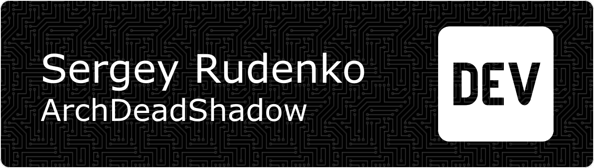

<header>
  <h1 align="center">👋 Hi there! I'm a JavaScript developer passionate about building modern web applications and scalable solutions. My expertise lies in crafting interactive user interfaces and robust backend systems.</h1>
  <h2 align="center">⚡ Passionate fullstack web developer, creating robust and scalable web applications. Skilled in both front-end and back-end technologies, with a keen eye for user experience and performance optimization.</h2>
  <h3 align="center">🚀 Open to collaborations, open-source contributions, and interesting challenges. Feel free to reach out for technical discussions or potential opportunities! Connect with me:</h3>
  
  
  
</header>

<main style="margin: 32px 0;">
  <h1 align="center">🦉 Skills</h1>

### 💻 Technical Toolkit

- **Languages**: JavaScript (ES6+), HTML5, CSS3
- **Frontend**: React.js (Hooks, Context API, React Router)
- **Backend**: Node.js, Express.js
- **Databases**: MongoDB (Mongoose ODM, database design)
- **Tools**: Git, REST APIs, Webpack, npm/yarn

### 😎 What I Do Best

- Develop responsive SPAs with React
- Create RESTful APIs using Node.js/Express
- Design efficient database architectures with MongoDB
- Implement full-stack solutions from concept to deployment

### 📌 Current Focus

Sharpening my skills in performance optimization and exploring TypeScript integration. Always learning new patterns and best practices!

### 🗂️ Featured Projects

Check out my repositories below to see examples of:

- Full-stack MERN applications
- Reusable React components
- API development projects
- Database optimization techniques
</main>

<footer>
    

    <picture>
      <source media="(prefers-color-scheme: dark)" srcset="img/svg/snake/github-snake-dark.svg">
      <source media="(prefers-color-scheme: light)" srcset="img/svg/snake/github-snake.svg">
      
    </picture>
  

   
  

        
  

   
  

    <h3 align="left">💸 Support Me</h3>
    

  

</footer>
