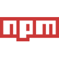

<!DOCTYPE html>
<html lang="en">
<head>
  <meta charset="UTF-8">
  <meta name="viewport" content="width=device-width, initial-scale=1.0">
</head>
<body>
  <header style="margin: 30px auto">
    

      <picture>
        <source media="(prefers-color-scheme: dark)" srcset="./img/header_main_image/compressed/github_header_image_dev_dark_compressed.gif">
        <source media="(prefers-color-scheme: light)" srcset="./img/header_main_image/compressed/github-header-image_dev_light_compressed.gif">
        
      </picture>
    

    <h1 align="center" style="margin: 30px auto">👋 Hi there! I'm a JavaScript developer passionate about building modern web applications and scalable solutions. My expertise lies in crafting interactive user interfaces and robust backend systems</h1>
    <h2 align="center" style="margin: 20px auto">⚡ Passionate fullstack web developer, creating robust and scalable web applications. Skilled in both front-end and back-end technologies, with a keen eye for user experience and performance optimization</h2>
    <h3 align="center" style="margin: 10px auto">🚀 Open to collaborations, open-source contributions, and interesting challenges. Feel free to reach out for technical discussions or potential opportunities! Connect with me:</h3>
    

      &nbsp;&nbsp;&nbsp;
      &nbsp;&nbsp;&nbsp;
      &nbsp;&nbsp;&nbsp;
      <a href="https://x.com/ArchDeadShadow" target="_blank">
      <picture>
        <source media="(prefers-color-scheme: dark)" srcset="./img/icons/x-light.svg">
        <source media="(prefers-color-scheme: light)" srcset="./img/icons/x-dark.svg">
        
      </picture></a>&nbsp;&nbsp;&nbsp;
      &nbsp;&nbsp;&nbsp;
      &nbsp;&nbsp;&nbsp;
    

  </header>
  <main style="margin: 30px auto">
  <h1 align="center" style="margin: 30px auto;">🦉 Skills</h1>
  <h3 align="center" style="margin: 36px auto">💻 Technical Toolkit</h3>
    <ul align="left">
      <li><strong>Languages</strong>: JavaScript (ES6+), HTML5, CSS3</li>
      <li><strong>Frontend</strong>: React.js (Hooks, Context API, React Router)</li>
      <li><strong>Backend</strong>: Node.js, Express.js</li>
      <li><strong>Databases</strong>: MongoDB (Mongoose ODM, database design)</li>
      <li><strong>Tools</strong>: Git, REST APIs, Webpack, npm/yarn</li>
    </ul>
    <h3 align="center" style="margin: 36px auto">😎 What I Do Best</h3>
    <ul align="left">
      <li>Develop responsive SPAs with React</li>
      <li>Create RESTful APIs using Node.js/Express</li>
      <li>Design efficient database architectures with MongoDB</li>
      <li>Implement full-stack solutions from concept to deployment</li>
    </ul>
    <h3 align="center" style="margin: 36px auto">📌 Current Focus</h3>
    
Sharpening my skills in performance optimization and exploring TypeScript integration. Always learning new patterns and best practices!

    <h3 align="center" style="margin: 36px auto">🗂️ Featured Projects</h3>
    
Check out my repositories below to see examples of:

    <ul align="left">
      <li>Full-stack <strong>MERN</strong> applications</li>
      <li>Reusable React components</li>
      <li>API development projects</li>
      <li>Database optimization techniques</li>
    </ul>
  </main>
  <footer style="margin: 30px auto">
    

      <picture>
        <source media="(prefers-color-scheme: dark)" srcset="./img/snake_game_contribution_calendar/github-snake-dark.svg">
        <source media="(prefers-color-scheme: light)" srcset="./img/snake_game_contribution_calendar/github-snake.svg">
        
      </picture>
    

     
    

      &nbsp;&nbsp;&nbsp;
      &nbsp;&nbsp;&nbsp;
      &nbsp;&nbsp;&nbsp;
      &nbsp;&nbsp;&nbsp;
      &nbsp;&nbsp;&nbsp;
      &nbsp;&nbsp;&nbsp;
      &nbsp;&nbsp;&nbsp;
      &nbsp;&nbsp;&nbsp;
      &nbsp;&nbsp;&nbsp;
      &nbsp;&nbsp;&nbsp;
      &nbsp;&nbsp;&nbsp;
      &nbsp;&nbsp;&nbsp;
      &nbsp;&nbsp;&nbsp;
      &nbsp;&nbsp;&nbsp;
      &nbsp;&nbsp;&nbsp;
      &nbsp;&nbsp;&nbsp;
      &nbsp;&nbsp;&nbsp;
      <picture>
        <source media="(prefers-color-scheme: dark)" srcset="./img/icons/expressjs-light.svg">
        <source media="(prefers-color-scheme: light)" srcset="./img/icons/expressjs-dark.svg">
        
      </picture>&nbsp;&nbsp;&nbsp;
      &nbsp;&nbsp;&nbsp;
      &nbsp;&nbsp;&nbsp;
    

     
    

      <h3>💸 Support Me</h3>
      

    

  </footer>
</body>
</html>
